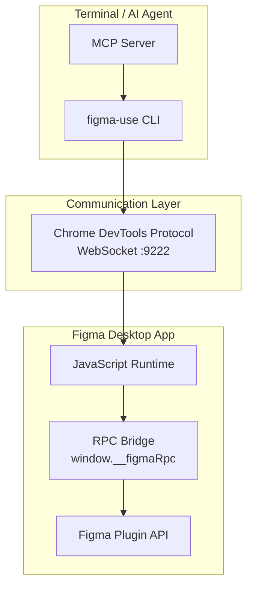

# figma-use 核心架构

## 整体架构图



## 核心组件

### 1. CDP 通信层 (`cdp.ts`)

figma-use 使用 **Chrome DevTools Protocol** 与 Figma 通信。这是 Chromium 提供的调试协议。

```typescript
// 连接流程
1. Figma 以 --remote-debugging-port=9222 启动
2. 访问 http://localhost:9222/json 获取调试目标
3. 建立 WebSocket 连接到 webSocketDebuggerUrl
4. 使用 Runtime.evaluate 执行 JavaScript 代码
```

**关键代码片段**：

```typescript
// 发送命令到 Figma
ws.send(JSON.stringify({
  id,
  method: 'Runtime.evaluate',
  params: {
    expression: code,      // 要执行的 JavaScript
    awaitPromise: true,    // 等待 Promise 完成
    returnByValue: true    // 返回值（而非引用）
  }
}))
```

### 2. RPC Bridge (`rpc.ts`)

一个 168KB+ 的核心模块，被注入到 Figma 的 JavaScript 上下文中：

```typescript
// 注入到 window.__figmaRpc
window.__figmaRpc = async (command, args) => {
  switch (command) {
    case 'create-frame':
      return figma.createFrame()
    case 'get-selection':
      return figma.currentPage.selection
    // ... 100+ 命令
  }
}
```

**特点**：
- 完全访问 `figma` 全局对象（Plugin API）
- 支持异步操作（如 loadFont、getNodeById）
- 批量操作优化

### 3. Client 层 (`client.ts`)

负责 RPC 的注入和版本管理：

```typescript
async function ensureRpcInjected() {
  // 1. 构建 RPC bundle (esbuild)
  const { code, hash } = await buildRpcBundle()
  
  // 2. 检查是否需要重新注入
  const remoteHash = await cdpEval('window.__figmaRpcHash')
  if (remoteHash === hash) return
  
  // 3. 注入代码
  await cdpEval(code)
  await cdpEval(`window.__figmaRpcHash = "${hash}"`)
}
```

## 数据流

```
┌──────────────────────────────────────────────────────────────────┐
│                        figma-use create frame                     │
└──────────────────────────────────────────────────────────────────┘
                                │
                                ▼
┌──────────────────────────────────────────────────────────────────┐
│ CLI 解析参数，生成 RPC 调用                                        │
│ sendCommand('create-frame', { width: 400, height: 300 })         │
└──────────────────────────────────────────────────────────────────┘
                                │
                                ▼
┌──────────────────────────────────────────────────────────────────┐
│ CDP 层通过 WebSocket 发送                                          │
│ Runtime.evaluate: window.__figmaRpc('create-frame', {...})       │
└──────────────────────────────────────────────────────────────────┘
                                │
                                ▼
┌──────────────────────────────────────────────────────────────────┐
│ Figma 内部执行                                                     │
│ const frame = figma.createFrame()                                 │
│ frame.resize(400, 300)                                            │
│ return serializeNode(frame)                                       │
└──────────────────────────────────────────────────────────────────┘
                                │
                                ▼
┌──────────────────────────────────────────────────────────────────┐
│ 返回结果                                                           │
│ { id: "1:23", name: "Frame", type: "FRAME", ... }                │
└──────────────────────────────────────────────────────────────────┘
```

## 技术栈

| 层级 | 技术 | 说明 |
|------|------|------|
| CLI | [citty](https://github.com/unjs/citty) | 命令行框架 |
| 构建 | [esbuild](https://esbuild.github.io/) | 快速 TypeScript 编译 |
| 通信 | WebSocket (原生) | Node 21+ 支持 |
| 渲染 | 自研 JSX Runtime | 类 React 语法 |
| 图标 | [@iconify/utils](https://iconify.design/) | 150k+ 图标 |
| 布局 | [d3-hierarchy](https://d3js.org/d3-hierarchy) | treemap 布局算法 |
| 查询 | [fontoxpath](https://github.com/FontoXML/fontoxpath) | XPath 3.1 引擎 |

## 目录结构

```
packages/
├── cli/
│   └── src/
│       ├── cdp.ts           # CDP 通信
│       ├── client.ts        # RPC 客户端
│       ├── commands/        # 100+ CLI 命令
│       ├── render/          # JSX 渲染
│       │   ├── jsx-runtime.ts
│       │   ├── tree.ts
│       │   └── vars.ts      # Variables 处理
│       └── jsx-generator.ts # Figma → JSX 导出
│
├── plugin/
│   └── src/
│       ├── rpc.ts           # RPC 处理器 (168KB)
│       ├── query.ts         # XPath 查询
│       └── shared.ts        # 共享工具函数
│
├── mcp/                     # MCP 服务器
├── linter/                  # 设计 lint 规则
└── render/                  # 运行时导出
```

## 为什么选择 CDP？

| 方案 | 优点 | 缺点 |
|------|------|------|
| **CDP (figma-use)** | 无需安装插件、完全控制、实时交互 | 需要 debug 端口、桌面应用限定 |
| Figma Plugin | 官方支持、沙箱安全 | 需要安装、权限受限 |
| Figma REST API | 跨平台、无需桌面应用 | 只读为主、无法创建节点 |

> CDP 是目前唯一能够**读写** Figma 并且**无需安装任何东西**的方案。
