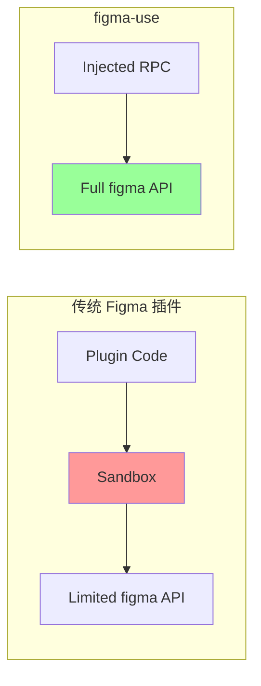

# Figma API 集成详解

## 核心原理

figma-use 通过 **直接调用 Figma Plugin API** 来操作设计。与官方插件不同的是，它通过 CDP 注入代码而非插件沙箱运行。



## Figma Plugin API 概览

Figma 提供的全局 `figma` 对象包含了所有操作能力：

### 读取操作

```typescript
// 获取当前页面
figma.currentPage

// 获取选中节点
figma.currentPage.selection

// 通过 ID 获取节点
await figma.getNodeByIdAsync("1:23")

// 获取所有变量
await figma.variables.getLocalVariablesAsync()
```

### 创建操作

```typescript
// 创建基础图形
figma.createRectangle()
figma.createEllipse()
figma.createLine()
figma.createFrame()
figma.createText()
figma.createVector()

// 创建组件
figma.createComponent()
figma.createComponentSet()

// 布尔运算
figma.union(nodes)
figma.subtract(nodes)
figma.intersect(nodes)
figma.exclude(nodes)
```

### 样式操作

```typescript
// 设置填充
node.fills = [{ type: 'SOLID', color: { r: 1, g: 0, b: 0 } }]

// 设置描边
node.strokes = [{ type: 'SOLID', color: { r: 0, g: 0, b: 0 } }]
node.strokeWeight = 2

// 设置圆角
node.cornerRadius = 12

// 设置效果（阴影、模糊）
node.effects = [{ type: 'DROP_SHADOW', ... }]
```

## RPC 命令映射

figma-use 将 CLI 命令映射到 Plugin API 调用：

| CLI 命令 | Plugin API 调用 |
|----------|-----------------|
| `create frame` | `figma.createFrame()` |
| `create text` | `figma.createText()` |
| `set fill <id>` | `node.fills = [...]` |
| `node move <id>` | `node.x = x; node.y = y` |
| `export node <id>` | `node.exportAsync()` |
| `query "//FRAME"` | XPath on document tree |

## 完整命令处理流程

```typescript
// packages/plugin/src/rpc.ts 中的核心处理逻辑

async function handleCommand(command: string, args?: unknown) {
  switch (command) {
    case 'create-frame': {
      const { x, y, width, height, fill, layout, ... } = args
      
      // 1. 创建节点
      const frame = figma.createFrame()
      
      // 2. 设置位置和尺寸
      frame.x = x
      frame.y = y
      frame.resize(width, height)
      
      // 3. 设置填充（支持变量绑定）
      if (fill) {
        frame.fills = [await createSolidPaint(fill)]
      }
      
      // 4. 设置布局
      if (layout) {
        frame.layoutMode = layout // HORIZONTAL | VERTICAL
      }
      
      // 5. 返回序列化结果
      return serializeNode(frame)
    }
    
    case 'set-fill': {
      const { id, color } = args
      const node = await figma.getNodeByIdAsync(id)
      
      // 解析颜色（支持 hex 和 variable）
      if (color.startsWith('$') || color.startsWith('var:')) {
        // 绑定到 Figma Variable
        const variable = await findVariable(color)
        node.fills = [
          figma.variables.setBoundVariableForPaint(
            { type: 'SOLID', color: { r: 0, g: 0, b: 0 } },
            'color',
            variable
          )
        ]
      } else {
        // 直接使用 hex 颜色
        node.fills = [{ type: 'SOLID', color: hexToRgb(color) }]
      }
    }
    
    // ... 100+ 其他命令
  }
}
```

## 字体加载

文本操作需要先加载字体：

```typescript
// 必须在设置文字内容前加载字体
await figma.loadFontAsync({ family: "Inter", style: "Regular" })

const text = figma.createText()
text.fontName = { family: "Inter", style: "Regular" }
text.characters = "Hello World"
```

figma-use 自动处理字体加载：

```typescript
async function loadFont(family: string, style: string) {
  try {
    await figma.loadFontAsync({ family, style })
  } catch {
    // 回退到 Inter Regular
    await figma.loadFontAsync({ family: "Inter", style: "Regular" })
  }
}
```

## 批量操作优化

对于多个节点的操作，figma-use 支持批量命令：

```typescript
// 单次 RPC 调用处理多个命令
case 'batch': {
  const results = []
  
  for (const cmd of commands) {
    const node = await createNodeFast(cmd.command, cmd.args)
    results.push({ id: node.id, name: node.name })
  }
  
  // 批量提交到 undo 栈
  figma.commitUndo()
  
  return results
}
```

## 导出功能

```typescript
// 导出为 PNG/SVG/PDF
const bytes = await node.exportAsync({
  format: 'PNG',  // or 'SVG', 'PDF'
  scale: 2        // 2x 分辨率
})

// 截图视口
const bytes = await figma.createImage(node.id).getBytesAsync()
```

## 不需要 Figma Access Token

> **重要**：figma-use 不需要 Figma Access Token！

因为它直接在 Figma 桌面应用内部运行，继承了用户的登录状态。这也意味着：

1. 可以访问用户有权限的所有文件
2. 操作权限与用户权限一致
3. 评论、版本历史等都可以访问

## API 完整性

figma-use 几乎覆盖了完整的 Plugin API：

| 类别 | 覆盖率 | 说明 |
|------|--------|------|
| 节点创建 | 100% | 所有基础图形 |
| 节点修改 | 95%+ | 包括嵌套属性 |
| 布局 | 100% | Auto Layout + Grid |
| 样式 | 90%+ | Fills/Strokes/Effects |
| 组件 | 90% | Component/Set/Instance |
| Variables | 80% | 创建/绑定/模式切换 |
| 导出 | 100% | PNG/SVG/PDF |
| 查询 | 自定义 | XPath 3.1 扩展 |

## 示例：完整的组件创建流程

```bash
# 1. 创建基础按钮框架
figma-use create frame --width 120 --height 40 --fill "#3B82F6" \
  --radius 8 --layout HORIZONTAL --gap 8 --padding 16 --name "Button"

# 2. 添加图标
figma-use create icon lucide:star --size 16 --color "#FFF" \
  --parent <frame-id>

# 3. 添加文字
figma-use create text --text "Click me" --font-size 14 \
  --fill "#FFF" --parent <frame-id>

# 4. 转换为组件
figma-use node to-component <frame-id>
```
