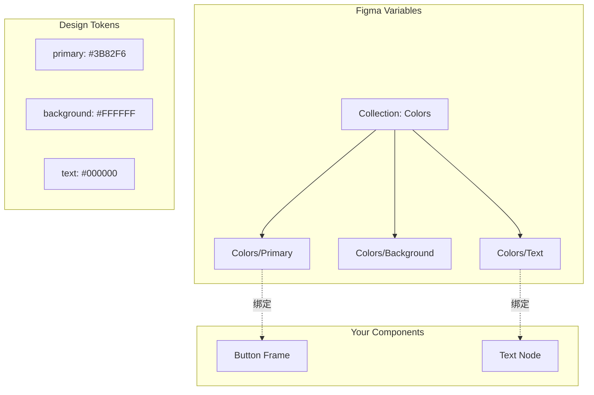

# Design System 绑定

## 理解 Figma Variables

Figma Variables 是设计系统的核心，让颜色、间距等值可以：
- 统一管理
- 支持主题切换（Light/Dark）
- 在设计和代码间同步



## 在 figma-use 中使用 Variables

### 方式一：直接引用变量名

```bash
# CLI 命令
figma-use create frame --fill "var:Colors/Primary"
figma-use create frame --fill "$Colors/Primary"  # 简写

figma-use set fill 1:23 "$Brand/Accent"
```

### 方式二：JSX 中引用

```tsx
// 直接在样式中使用变量名
<Frame bg="$Colors/Primary">
  <Text color="var:Text/Primary">Hello</Text>
</Frame>
```

### 方式三：defineVars 定义 tokens

```tsx
import { defineVars, Frame, Text } from 'figma-use/render'

// 定义你的设计 tokens
const colors = defineVars({
  bg: { name: 'Colors/Gray/50', value: '#F8FAFC' },      // 变量名 + 回退值
  text: { name: 'Colors/Gray/900', value: '#0F172A' },
  primary: { name: 'Colors/Blue/500', value: '#3B82F6' }
})

// 在组件中使用
export default () => (
  <Frame bg={colors.bg} p={24}>
    <Text color={colors.text}>Bound to Variables</Text>
    <Frame bg={colors.primary} px={16} py={8}>
      <Text color="#FFF">Button</Text>
    </Frame>
  </Frame>
)
```

**defineVars 的工作原理**：

```typescript
// packages/cli/src/render/vars.ts

export function defineVars<T extends Record<string, VarDef>>(vars: T) {
  const result = {} as Record<keyof T, VarValue>
  
  for (const [key, def] of Object.entries(vars)) {
    result[key] = {
      __isVar: true,
      name: def.name,      // Figma 变量路径
      fallback: def.value  // 如果变量不存在，使用此值
    }
  }
  
  return result
}
```

## 与现有 Design System 集成

### shadcn/ui 示例

项目中提供了完整的 shadcn/ui tokens 示例：

```typescript
// examples/shadcn/tokens.ts

export const colors = {
  background: '#FFFFFF',
  foreground: '#09090B',
  primary: '#18181B',
  primaryForeground: '#FAFAFA',
  secondary: '#F4F4F5',
  muted: '#F4F4F5',
  mutedForeground: '#71717A',
  destructive: '#EF4444',
  border: '#E4E4E7',
  // ... 更多颜色
}

export const spacing = {
  0: 0,
  1: 4,
  2: 8,
  3: 12,
  4: 16,
  // ... 8px 网格系统
}

export const radius = {
  none: 0,
  sm: 2,
  default: 6,
  md: 8,
  lg: 12,
  full: 9999,
}
```

### 使用 tokens 创建组件

```tsx
// examples/shadcn/components.tsx

import { colors, radius, spacing } from './tokens'

export function Button({ children, variant = 'default' }) {
  const variants = {
    default: { bg: colors.primary, color: colors.primaryForeground },
    secondary: { bg: colors.secondary, color: colors.secondaryForeground },
    destructive: { bg: colors.destructive, color: colors.destructiveForeground },
  }
  
  const v = variants[variant]
  
  return (
    <frame
      name={`Button/${variant}`}
      h={40}
      px={16}
      bg={v.bg}
      rounded={radius.default}
      flex="row"
      items="center"
      justify="center"
    >
      <text size={14} weight="medium" color={v.color}>
        {children}
      </text>
    </frame>
  )
}
```

## 变量管理命令

```bash
# 列出所有变量
figma-use variable list

# 按名称搜索变量
figma-use variable find "Text/Neutral"
figma-use variable find "Color" --type COLOR --limit 10

# 获取变量详情
figma-use variable get <variable-id>

# 创建新变量
figma-use variable create "Primary" \
  --collection <collection-id> \
  --type COLOR \
  --value "#3B82F6"

# 设置变量值
figma-use variable set <id> --value "#FF0000"
figma-use variable set <id> --value "#FF0000" --mode "Dark"  # 特定模式

# 绑定变量到节点
figma-use variable bind <node-id> --variable <var-id> --field fills
```

## Collections 管理

```bash
# 列出所有集合
figma-use collection list

# 获取集合详情
figma-use collection get <id>

# 创建集合（支持多模式）
figma-use collection create "Colors" --modes "Light,Dark"

# 删除集合
figma-use collection delete <id>
```

## 实战：创建主题系统

### 1. 定义变量结构

```bash
# 创建颜色集合
figma-use collection create "Brand Colors" --modes "Light,Dark"

# 创建主色
figma-use variable create "Primary/500" \
  --collection <brand-colors-id> \
  --type COLOR \
  --value "#3B82F6"

# 为 Dark 模式设置不同值
figma-use variable set <primary-id> --value "#60A5FA" --mode "Dark"
```

### 2. 在设计中使用

```tsx
import { defineVars, Frame, Text } from 'figma-use/render'

// 绑定到 Figma Variables
const theme = defineVars({
  primary: { name: 'Primary/500', value: '#3B82F6' },
  background: { name: 'Background', value: '#FFFFFF' },
  text: { name: 'Text/Primary', value: '#000000' }
})

// 组件自动使用变量绑定
function Card() {
  return (
    <Frame bg={theme.background} p={24} rounded={12}>
      <Text color={theme.text}>Card Title</Text>
      <Frame bg={theme.primary} px={16} py={8} rounded={6}>
        <Text color="#FFF">Action</Text>
      </Frame>
    </Frame>
  )
}
```

### 3. 切换主题预览

在 Figma 中切换变量模式即可预览 Light/Dark 效果。

## 分析现有设计系统

figma-use 提供工具分析现有设计：

```bash
# 分析颜色使用情况
figma-use analyze colors
# 输出:
# #303030  ████████████████████ 1840× (var)
# #E5E5E5  ████████████████████ 1726× (var)
# #000000  ████████ 238×

# 查找相似颜色（可合并）
figma-use analyze colors --show-similar

# 分析间距
figma-use analyze spacing --grid 8
# 警告不符合 8px 网格的间距

# 分析排版
figma-use analyze typography --group-by size
```

## Design System 最佳实践

| 实践 | 说明 |
|------|------|
| **使用语义化命名** | `Colors/Primary` 而非 `Blue/500` |
| **建立层级结构** | `Button/Primary/Default`, `Button/Primary/Hover` |
| **定义回退值** | defineVars 中始终提供 value |
| **保持 8px 网格** | spacing tokens 使用 8 的倍数 |
| **文档化 tokens** | 在 tokens.ts 中添加注释 |
