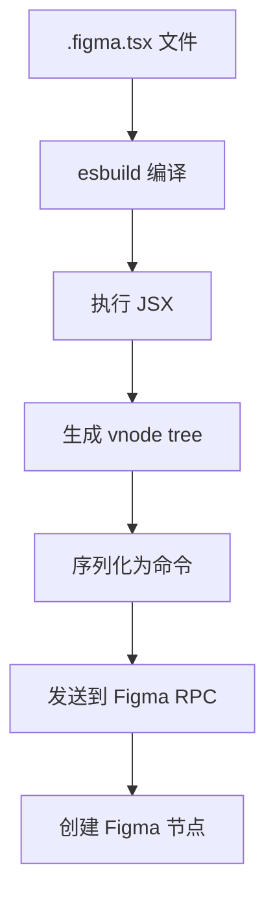

# JSX 渲染系统

## 为什么用 JSX？

LLM 已经训练过海量的 React 代码。用 JSX 描述 UI：

1. **LLM 原生** - 无需学习新语法
2. **声明式** - 描述"是什么"而非"怎么做"
3. **组件化** - 复用和组合
4. **类型安全** - TypeScript 支持

```tsx
// LLM 非常熟悉这种风格
<Frame flex="col" gap={16} p={24} bg="#FFF">
  <Text size={24} weight="bold">Card Title</Text>
  <Text size={14} color="#666">Description text</Text>
</Frame>
```

## 两种使用方式

### 1. Stdin 模式（快速测试）

```bash
echo '<Frame w={100} h={100} bg="#F00" />' | figma-use render --stdin --x 100 --y 100
```

### 2. 文件模式（完整功能）

```bash
figma-use render ./Button.figma.tsx --x 100 --y 200
```

## 可用元素

| 元素 | 说明 | 对应 Figma |
|------|------|-----------|
| `<Frame>` | 容器/布局 | FrameNode |
| `<Rectangle>` | 矩形 | RectangleNode |
| `<Ellipse>` | 椭圆/圆 | EllipseNode |
| `<Text>` | 文本 | TextNode |
| `<Line>` | 线条 | LineNode |
| `<Star>` | 星形 | StarNode |
| `<Polygon>` | 多边形 | PolygonNode |
| `<Vector>` | 矢量路径 | VectorNode |
| `<Group>` | 分组 | GroupNode |
| `<Icon>` | 图标 | Frame with Vector |
| `<Image>` | 图片 | Frame with Image Fill |
| `<Instance>` | 组件实例 | InstanceNode |

## 样式 Shorthands

为了节省 token，figma-use 提供大量简写：

### 尺寸和位置

```tsx
// 完整写法 vs 简写
<Frame width={400} height={300} />  // ❌ 冗长
<Frame w={400} h={300} />           // ✅ 简洁

// fill 表示撑满父容器
<Frame w="fill" h="fill" />
```

### 布局

```tsx
// Flexbox 布局
<Frame flex="row" gap={16} />        // 水平
<Frame flex="col" gap={16} />        // 垂直

// 对齐
<Frame justify="center" items="center" />  // 居中
<Frame justify="between" />                // space-between

// Padding
<Frame p={24} />                     // 四边 24px
<Frame px={16} py={8} />             // 水平 16px, 垂直 8px
<Frame pt={24} pb={16} pl={8} pr={8} />  // 单独设置
```

### 外观

```tsx
// 背景
<Frame bg="#3B82F6" />
<Frame bg="$Colors/Primary" />  // 使用变量

// 边框
<Frame stroke="#E5E7EB" strokeWidth={1} />

// 圆角
<Frame rounded={12} />
<Frame roundedTL={8} roundedTR={8} />  // 单独设置

// 透明度
<Frame opacity={0.5} />

// 阴影
<Frame shadow="0px 4px 8px rgba(0,0,0,0.25)" />
```

### 文本

```tsx
<Text 
  size={18}           // fontSize
  weight="bold"       // fontWeight
  color="#000"        // 文字颜色
  font="Inter"        // fontFamily
/>
```

### Grid 布局

```tsx
<Frame 
  display="grid"
  cols="1fr 1fr 1fr"    // 3 列等宽
  rows="auto auto"       // 2 行自适应
  gap={16}
  colGap={20}           // 单独设置列间距
  rowGap={12}           // 单独设置行间距
>
  {/* 6 个子元素会自动排列 */}
</Frame>
```

## 组件定义

### 简单组件

```tsx
import { defineComponent, Frame, Text } from 'figma-use/render'

// 第一次渲染创建 Component
// 后续渲染创建 Instance
const Card = defineComponent(
  'Card',  // 组件名
  <Frame p={24} bg="#FFF" rounded={12}>
    <Text size={18} color="#000">Card</Text>
  </Frame>
)

export default () => (
  <Frame gap={16} flex="row">
    <Card />    {/* 第一个创建 Component */}
    <Card />    {/* 第二个创建 Instance */}
    <Card />    {/* 也是 Instance */}
  </Frame>
)
```

### 带变体的组件 (ComponentSet)

```tsx
import { defineComponentSet, Frame, Text } from 'figma-use/render'

const Button = defineComponentSet(
  'Button',
  {
    variant: ['Primary', 'Secondary'] as const,
    size: ['Small', 'Large'] as const
  },
  ({ variant, size }) => (
    <Frame
      p={size === 'Large' ? 16 : 8}
      bg={variant === 'Primary' ? '#3B82F6' : '#E5E7EB'}
      rounded={8}
    >
      <Text color={variant === 'Primary' ? '#FFF' : '#111'}>
        {variant} {size}
      </Text>
    </Frame>
  )
)

// 自动生成所有组合：
// Primary + Small
// Primary + Large
// Secondary + Small
// Secondary + Large
```

## 使用现有组件实例

```tsx
// 通过组件 ID 创建实例
<Frame flex="row" gap={8}>
  <Instance component="59763:10626" />
  <Instance component="59763:10629" />
</Frame>
```

## 渲染流程



### 内部实现

```typescript
// packages/cli/src/render/jsx-runtime.ts

export function jsx(
  type: string | Function,
  props: Record<string, any>
) {
  // 自定义组件
  if (typeof type === 'function') {
    return type(props)
  }
  
  // 内置元素
  return {
    type,
    props,
    children: props.children
  }
}
```

## 导出为 JSX

反向操作 - 从 Figma 导出 JSX：

```bash
# 导出单个节点
figma-use export jsx 123:456 --pretty

# 输出：
import { Frame, Text, Icon } from 'figma-use/render'

export default function SaveButton() {
  return (
    <Frame name="SaveButton" w={120} h={44} bg="#1FAFBB" rounded={8} flex="row" gap={8}>
      <Icon name="lucide:save" size={18} color="#FFFFFF" />
      <Text size={16} color="#FFFFFF">Save</Text>
    </Frame>
  )
}
```

### 图标匹配

```bash
# 自动匹配矢量图形到 Iconify 图标
figma-use export jsx 123:456 --match-icons --prefer-icons lucide,tabler
```

## Round-trip 工作流

```bash
# 1. 导出现有设计
figma-use export jsx 123:456 --pretty > Card.figma.tsx

# 2. 编辑代码
# ... 修改 Card.figma.tsx ...

# 3. 重新渲染
figma-use render Card.figma.tsx --x 500 --y 0

# 4. 对比差异
figma-use diff jsx 123:456 789:012
```

## 最佳实践

### 1. 始终指定位置

```bash
# ❌ 会堆叠在 (0,0)
echo '...' | figma-use render --stdin
echo '...' | figma-use render --stdin

# ✅ 分开放置
echo '...' | figma-use render --stdin --x 0 --y 0
echo '...' | figma-use render --stdin --x 500 --y 0
```

### 2. Row 布局需要宽度

```tsx
// ❌ 会折叠成 1×1
<Frame flex="row" gap={8}>
  <Frame w={100} h={50} />
</Frame>

// ✅ 指定容器宽度
<Frame w={300} flex="row" gap={8}>
  <Frame w={100} h={50} />
</Frame>
```

### 3. 使用 arrange 整理

```bash
# 批量创建后整理布局
figma-use arrange --mode grid --gap 60
figma-use arrange --mode squarify --gap 60  # 智能排列
```

### 4. 验证结果

```bash
# 渲染后截图检查
figma-use export node <id> --output /tmp/check.png

# 缩放到节点
figma-use viewport zoom-to-fit <id>
```
