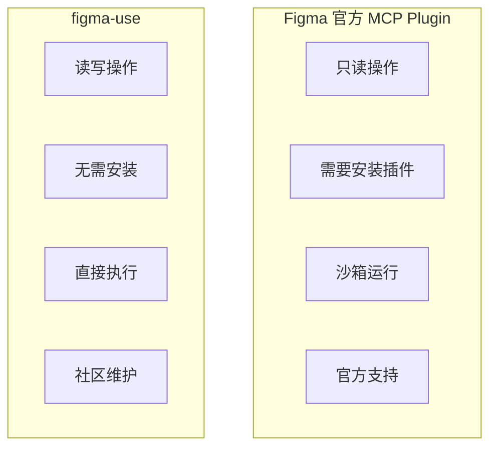

# 风险与兼容性分析

## 官方支持情况

### Chrome DevTools Protocol (CDP)

| 方面 | 状态 | 说明 |
|------|------|------|
| **协议本身** | ✅ 官方标准 | Chromium 官方调试协议 |
| **Figma 支持** | ⚠️ 未文档化 | Figma 基于 Electron，支持 CDP，但非官方功能 |
| **--remote-debugging-port** | ✅ Chromium 标准 | Electron 应用通用参数 |

### Figma Plugin API

| 方面 | 状态 | 说明 |
|------|------|------|
| **API 本身** | ✅ 官方 | 有完整文档和类型定义 |
| **通过 CDP 调用** | ⚠️ 非官方 | 绕过了官方插件沙箱 |
| **API 覆盖** | ✅ 完整 | 可访问所有 figma.* 方法 |

## 风险评估

### 🟢 低风险

**1. API 兼容性**

Figma Plugin API 是稳定的公开 API：
- 有语义化版本控制
- 废弃前会提前通知
- TypeScript 类型定义完善

```typescript
// figma-use 使用的都是标准 API
figma.createFrame()           // 核心 API，极稳定
figma.currentPage.selection   // 基础属性
node.fills = [...]            // 标准属性设置
```

### 🟡 中等风险

**2. CDP 访问方式**

Figma 可能在未来：
- 禁用 `--remote-debugging-port`
- 添加连接验证
- 限制 `Runtime.evaluate`

```
┌────────────────────────────────────────────────────────────┐
│ 风险缓解：CDP 是 Chromium 标准功能，完全禁用可能性较低      │
│ Electron 应用普遍支持此功能用于开发和自动化测试             │
└────────────────────────────────────────────────────────────┘
```

**3. 内部 API 依赖**

部分功能依赖 Figma 内部 API：

```typescript
// 这些是"逆向工程"的内部 API，可能会变化
window.INITIAL_OPTIONS?.user_data        // 获取用户信息
window.webpackChunk_figma_web_bundler    // Webpack 访问
window.__findExport(...)                 // 查找内部模块
```

受影响的功能：
- `figma-use me` - 获取当前用户
- 本地插件列表
- 某些浏览器端 API 调用

### 🔴 潜在风险

**4. 使用条款**

> ⚠️ **重要提示**：通过 CDP 操作 Figma 可能违反 Figma 使用条款

Figma ToS 相关条款：
- 禁止"逆向工程"
- 禁止未经授权的自动化
- 禁止绕过安全措施

**实际风险**：
- 目前未见用户因使用类似工具被封禁
- figma-use 本质上是"本地自动化工具"
- 不涉及网络攻击或数据窃取

## 升级兼容性

### 可能导致不兼容的更新

| 更新类型 | 可能性 | 影响 | 应对方案 |
|----------|--------|------|----------|
| Figma 大版本升级 | 中 | Plugin API 变更 | 跟进 API 更新 |
| Electron 升级 | 低 | CDP 行为变化 | 通常向后兼容 |
| 安全加固 | 中 | 限制 CDP 访问 | 可能需要替代方案 |
| 内部重构 | 高 | 内部 API 失效 | 仅影响少数功能 |

### 版本检测

```bash
# figma-use 会检测连接状态
figma-use status

# 输出示例
✓ Connected to: Design System.fig
```

## 与官方 MCP 对比



| 方面 | Figma 官方 MCP | figma-use |
|------|---------------|-----------|
| **写入能力** | ❌ 只读 | ✅ 完整读写 |
| **安装** | 需要插件 | 无需安装 |
| **官方支持** | ✅ 是 | ❌ 社区项目 |
| **封禁风险** | 无 | 理论上存在 |
| **API 覆盖** | 有限 | 完整 |

## 最佳实践

### 降低风险的使用方式

**1. 个人/团队内部使用**
```
✅ 推荐：个人项目、内部工具、设计自动化
⚠️ 谨慎：大规模商业部署、公开服务
```

**2. 保守功能选择**
```typescript
// ✅ 使用标准 Plugin API
figma.createFrame()
node.fills = [...]

// ⚠️ 内部 API 可能变化
window.INITIAL_OPTIONS
```

**3. 版本锁定**
```bash
# package.json
{
  "dependencies": {
    "figma-use": "^0.x.x"  // 锁定主版本
  }
}
```

**4. 监控更新**
- 关注 Figma 更新日志
- 订阅 figma-use 仓库
- 测试环境先验证

## 替代方案

如果未来 CDP 被限制：

| 方案 | 可行性 | 限制 |
|------|--------|------|
| **Figma 官方插件** | 高 | 需要安装，沙箱限制 |
| **REST API** | 中 | 只读为主 |
| **Figma Widgets** | 中 | 仅限画布内交互 |
| **Dev Mode API** | 低 | 面向开发者，非设计操作 |

## 总结

```
┌─────────────────────────────────────────────────────────────────┐
│                          风险等级：中等                           │
├─────────────────────────────────────────────────────────────────┤
│                                                                  │
│  ✅ 核心功能基于稳定的官方 Plugin API                             │
│  ⚠️ CDP 通信方式是非官方的，但广泛用于 Electron 自动化            │
│  ⚠️ 可能违反 ToS，但目前无封禁案例                                │
│  🔄 需要持续关注 Figma 更新                                       │
│                                                                  │
│  建议：个人和团队内部使用风险可控                                  │
│                                                                  │
└─────────────────────────────────────────────────────────────────┘
```
