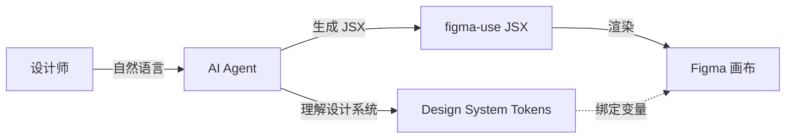
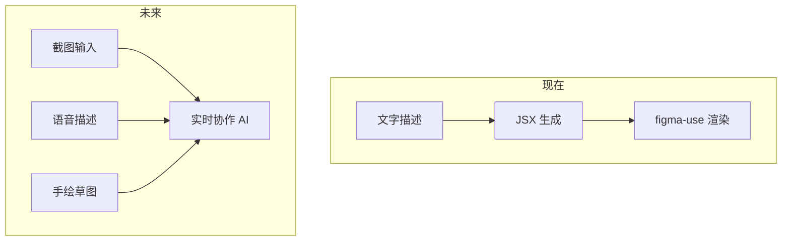

# AI Vibe Design：设计师的 AI 时代

## 什么是 Vibe Design？

类似于开发者的 **Vibe Coding**（用自然语言描述需求，AI 生成代码），**Vibe Design** 让设计师可以：

```
"我想要一个现代风格的登录页面，使用我们的品牌色"
     ↓ AI 
[直接在 Figma 中生成设计]
```

## figma-use 如何赋能 Vibe Design



### 核心优势

1. **复用现有设计系统** - AI 可以使用团队定义的 tokens
2. **直接输出到 Figma** - 不是截图，是真实的 Figma 节点
3. **可编辑结果** - 设计师可以继续调整

## 完整工作流

### 准备阶段：定义设计系统

```typescript
// tokens.ts - 团队统一的设计语言
export const colors = {
  primary: '#3B82F6',
  secondary: '#10B981',
  background: '#FFFFFF',
  text: '#09090B',
  muted: '#71717A',
}

export const spacing = {
  sm: 8,
  md: 16,
  lg: 24,
  xl: 32,
}

export const radius = {
  sm: 4,
  md: 8,
  lg: 12,
}
```

### 使用阶段：AI 生成设计

**设计师说**：
> "创建一个带有用户头像、标题和描述的卡片组件"

**AI 生成**：

```tsx
import { Frame, Text, Image } from 'figma-use/render'
import { colors, spacing, radius } from './tokens'

export default function UserCard() {
  return (
    <Frame 
      w={320} 
      bg={colors.background} 
      rounded={radius.lg}
      p={spacing.lg}
      flex="col"
      gap={spacing.md}
      shadow="0px 2px 8px rgba(0,0,0,0.1)"
    >
      {/* 头部：头像 + 信息 */}
      <Frame flex="row" gap={spacing.md} items="center">
        <Image 
          src="https://api.dicebear.com/7.x/avataaars/svg?seed=Felix"
          w={48} h={48} 
          rounded={999}
        />
        <Frame flex="col" gap={4}>
          <Text size={16} weight="semibold" color={colors.text}>
            John Doe
          </Text>
          <Text size={14} color={colors.muted}>
            Product Designer
          </Text>
        </Frame>
      </Frame>
      
      {/* 描述 */}
      <Text size={14} color={colors.text}>
        Creating delightful user experiences through thoughtful design.
      </Text>
      
      {/* 操作按钮 */}
      <Frame flex="row" gap={spacing.sm}>
        <Frame 
          bg={colors.primary} 
          px={spacing.md} py={spacing.sm}
          rounded={radius.sm}
        >
          <Text size={14} color="#FFF">Follow</Text>
        </Frame>
        <Frame 
          stroke={colors.muted}
          strokeWidth={1}
          px={spacing.md} py={spacing.sm}
          rounded={radius.sm}
        >
          <Text size={14} color={colors.text}>Message</Text>
        </Frame>
      </Frame>
    </Frame>
  )
}
```

**执行渲染**：

```bash
figma-use render ./UserCard.figma.tsx --x 100 --y 100
```

### 迭代阶段：持续对话

**设计师说**：
> "把主按钮改成渐变背景，圆角再大一点"

**AI 修改并重新渲染**...

## 设计师友好的交互方式

### 方式一：命令行对话

```bash
# 使用支持 figma-use 的 AI Agent
ai chat "在当前页面创建一个 3 列的功能介绍区域"
```

### 方式二：Comment-Driven（评论驱动）

```bash
# AI 监听 Figma 评论
figma-use comment watch --json

# 设计师在 Figma 中添加评论：
# "这个按钮太小了，加大到 48px 高度"

# AI 自动处理并回复
```

### 方式三：MCP 集成

在 Claude Desktop 或 Cursor 中直接对话：

```
Human: 帮我在 Figma 中创建一个 shadcn 风格的登录表单

Claude: [调用 figma-use MCP 工具创建设计]
```

## 真实场景示例

### 场景 1：快速原型

```
设计师：我需要快速做一个 dashboard 布局，左侧导航 + 顶部工具栏 + 主内容区

AI：[生成 JSX 并渲染]
```

### 场景 2：组件变体

```
设计师：把这个按钮做成组件，需要 Primary/Secondary/Ghost 三种样式，每种都有 Small/Medium/Large 尺寸

AI：[使用 defineComponentSet 生成所有变体]
```

### 场景 3：批量生成

```
设计师：根据这个卡片样式，生成 10 个不同内容的卡片放在画布上

AI：[批量渲染，自动排列]
```

### 场景 4：设计系统审查

```
设计师：检查这个页面有哪些颜色没有使用我们的变量

AI：[运行 figma-use analyze colors 并报告]
```

## 结合现有设计系统的关键

### 1. 导出你的 tokens

```bash
# 分析现有设计中的颜色和间距
figma-use analyze colors > current-colors.txt
figma-use analyze typography > current-typography.txt
figma-use analyze spacing --grid 8 > current-spacing.txt
```

### 2. 建立 tokens 文件

```typescript
// 根据分析结果创建 tokens.ts
export const colors = {
  // 从 analyze colors 结果中提取
}
```

### 3. 绑定 Figma Variables

```bash
# 确保 tokens 映射到 Figma Variables
figma-use variable list
figma-use variable find "Color"
```

### 4. 告诉 AI 使用你的系统

在与 AI 交互时提供上下文：

```
请使用以下设计 tokens：
- 主色：$Colors/Primary
- 间距：8px 网格
- 圆角：使用 tokens.radius
```

## Vibe Design 的限制

| 限制 | 说明 | 解决方案 |
|------|------|----------|
| **微调困难** | 像素级调整不适合自然语言 | 生成后手动调整 |
| **复杂交互** | 难以描述复杂动效 | 分步描述 + 手动完善 |
| **品牌一致性** | AI 可能偏离品牌风格 | 提供严格的 tokens |
| **上下文限制** | AI 可能不理解完整设计意图 | 分步骤迭代 |

## 未来展望



## 开始尝试

1. **安装 figma-use**
   ```bash
   npm install -g figma-use
   ```

2. **准备设计系统**
   - 创建 tokens.ts
   - 映射到 Figma Variables

3. **连接 AI Agent**
   - Claude Desktop + MCP
   - Cursor + figma-use
   - 自定义 Agent

4. **开始对话**
   ```
   "在画布上创建一个符合我们设计系统的导航栏"
   ```

---

> 💡 **关键洞察**：Vibe Design 不是要取代设计师，而是让设计师从重复性工作中解放出来，专注于创意和决策。AI 是画笔，设计师是艺术家。
